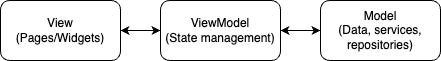

# Flutter New Joiner app

This is a basic app for new joiners to build to learn, apply and/or test their Flutter knowledge. You may refer to the `readme_images/` folder for the UI reference.

## Introduction

This app implements the following practical uses:
- UI building
- API calls
- Pagination
- Data passing
- `SharedPreferences` (similar to `LocalStorage` on web)

## Getting Started

You are expected to use an [MVVM](https://blog.devgenius.io/flutter-mvvm-architecture-with-provider-a81164ef6da6)-based architecture to build this app.



The general folder structure for your app should look as such:
```
.
├── helpers
├── models
│   └── api
├── repositories
├── services
├── ui
│   ├── pages
│   └── widgets
└── viewmodels
```

## Widgets

Some widgets are expected to be used in this project. We understand that there are multiple ways to construct a UI, but we would like for you to get accustomed to certain widgets that are of practical and heavy use

- Scaffold
- AppBar
- BottomTabBar
- Rows, Columns and Wrap
- Padding
- SizedBox
- Expanded, Flexible
- ListView (and it's other constructors)
- RefreshIndicator
- Dialog
- GestureDetectors, InkWells

## State management

We expect you to build this app using the following state management tools (separately):
- [flutter_riverpod](https://pub.dev/packages/flutter_riverpod)
- [provider](https://pub.dev/packages/provider)

## API calls

This app makes three different API calls:

1. https://pub.dev/api/search?q=provider&sort=like&page=1

where the possible values for the `sort` key are:
- top
- created
- updated
- popularity
- like
- points

The returned JSON response looks like
```json
{
    "packages": [
        {
            "package": "get"
        },
        {
            "package": "provider"
        },
        ...
    ],
    "next": "https://pub.dev/api/search?q=provider&sort=like&page=2"
}
```

2. https://pub.dev/api/packages/provider

which returns a large JSON response. The fields we are only interested in are:
```json
{
    "name": "provider",
    "latest": {
        "version": "6.0.4",
        "pubspec": {
            "name": "provider",
            "description": "A wrapper around InheritedWidget to make them easier to use and more reusable.",
            "version": "6.0.4",
        },
        "published": "2022-10-11T07:06:49.355255Z"
    },
}
```

3. https://pub.dev/api/packages/provider/publisher

which returns the following JSON response:
```json
{
    "publisherId": "dash-overflow.net"
}
```

## Packages

To build this app, you are expected to use the following packages:
- [dio](https://pub.dev/packages/dio) for API calls
- [freezed](https://pub.dev/packages/freezed) for model generation (i.e. fromJson, toJson)
- [package_info_plus](https://pub.dev/packages/package_info_plus) for getting app version
- [shared_preferences](https://pub.dev/packages/shared_preferences) to store your favourited packages
- [url_launcher](https://pub.dev/packages/url_launcher) to open URLs

## Linting

We expect good linting to be enforced. The recommended package (besides [flutter_lints](https://pub.dev/packages/flutter_lints)) is [very_good_analysis](https://pub.dev/packages/very_good_analysis). The following linting options should be enabled:

```yaml
include: package:very_good_analysis/analysis_options.2.4.0.yaml
analyzer:
  exclude:
    - '**/*.freezed.dart'
    - '**/*.g.dart'
  errors:
    missing_enum_constant_in_switch: error
linter:
  rules:
    public_member_api_docs: false
    flutter_style_todos: false
    no_default_cases: false
    avoid_catching_errors: false
    use_setters_to_change_properties: false
```

## Additional features that can be added

- Usage of `AnimatedList` for favourites (see video below)
- Show packages by user
